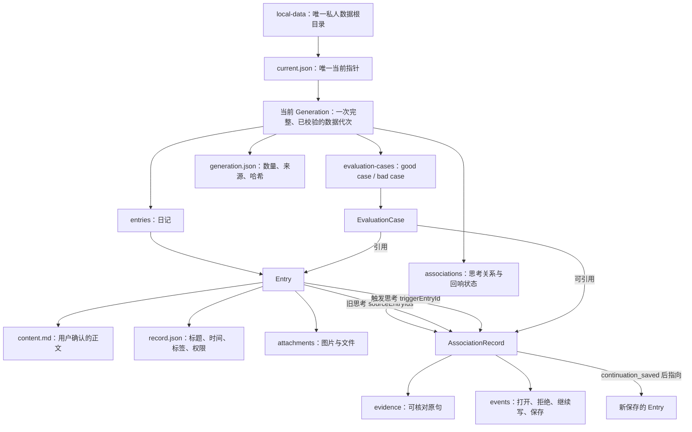

# 回页｜本地数据结构

> 状态：唯一数据字典  
> 最后更新：2026-08-02  
> 边界：私人数据只以 `local-data` 为主数据源；浏览器缓存、GitHub 和作品集网站都不是主数据源。

## 一句话理解

`current.json` 只指向一个当前有效代次；一个代次由日记、关系和校验信息组成。旧代次是自动保留的历史安全点，不是另一套同时生效的数据。

## 关系图



## 磁盘目录

```text
local-data/
├─ current.json
├─ generations/
│  └─ <generationId>/
│     ├─ generation.json
│     ├─ entries/
│     │  └─ <entryId>/
│     │     ├─ content.md
│     │     ├─ record.json
│     │     └─ attachments/
│     ├─ associations/
│     └─ evaluation-cases/
├─ pointer-history/
└─ imports/
```

`generations/.staging-*` 是写入过程中的临时目录。只有完整写入并通过校验的代次才能成为 `current.json` 指向的正式数据；程序中断后，下一次读取会接回比当前代次更新且校验完整的暂存代次。

## 当前正式格式：HuiyeBackup v1

这是应用当前读写的完整逻辑对象。磁盘会把它拆成便于阅读和校验的文件，但逻辑上仍是一份数据。

| 字段 | 类型 | 必填 | 允许值 / 含义 |
|---|---|---:|---|
| `format` | string | 是 | 固定为 `huiye-backup` |
| `version` | number | 是 | 当前固定为 `1` |
| `exportedAt` | ISO 时间 | 是 | 本次代次完成写入的时间 |
| `entries` | `Entry[]` | 是 | 全部日记 |
| `echoes` | `Echo[]` | 是 | 当前兼容回响；将迁移为 `AssociationRecord[]` |
| `echoCheckedIds` | `number[]` | 是 | 当前兼容检查标记；将迁移为可解释的评测/运行记录 |

## Entry：日记

| 字段 | 类型 | 必填 | 允许值 / 含义 |
|---|---|---:|---|
| `id` | number | 是 | 唯一 ID；当前由创建时的毫秒时间戳生成 |
| `title` | string | 是 | 标题 |
| `content` | string | 是 | 用户确认的唯一正文；落盘为 `content.md` |
| `createdAt` | ISO 时间 | 新记录是 | 创建时间 |
| `date` | string | 否 | 旧显示字段，例如“刚刚”；待移除 |
| `tags` | `string[]` | 是 | 标签，允许空数组 |
| `source` | string | 是 | 当前常见值：`快速记录`、`图片与快速记录` |
| `aiLink` | boolean | 是 | `true` 允许参与回响；`false` 只保存、不发送给回响判断 |
| `status` | string | 否 | 旧兼容值 `open` / `echoed`；待移除 |
| `attachments` | `Attachment[]` | 否 | 图片或文件 |
| `continuesFrom` | number | 否 | 旧单来源延续字段；迁移后由 Association 事件表达 |

### Attachment：附件

应用对象：

| 字段 | 类型 | 含义 |
|---|---|---|
| `name` | string | 用户看到的文件名 |
| `type` | string | MIME 类型，例如 `image/png` |
| `data` | string | 文本或 Base64 Data URL |

落盘记录还包含：`file`（实际文件名）、`encoding`（`text` / `base64`）和 `sha256`（完整性校验）。

## Echo：当前兼容回响

| 字段 | 类型 | 必填 | 含义 |
|---|---|---:|---|
| `id` | string | 是 | 回响 ID |
| `currentEntryId` | number | 是 | 触发判断的较新日记 |
| `previousEntryId` | number | 是 | 被找回的旧日记 |
| `quote` | string | 是 | 来自旧日记的精确原句 |
| `reason` | string | 是 | 为什么值得带回 |
| `createdAt` | ISO 时间 | 是 | 创建时间 |
| `status` | enum | 是 | `pending` / `opened` / `continued` / `irrelevant` |

当前 `continued` 只表示点击过“继续写”，不能证明延伸成功，因此 Echo 只作为迁移兼容结构。

## 最终关系格式：AssociationRecord

Echo、`continuesFrom` 和 `echoCheckedIds` 最终统一到关系记录和事件，不再分别表达同一件事。

| 字段 | 类型 | 必填 | 允许值 / 含义 |
|---|---|---:|---|
| `id` | string | 是 | 关系 ID |
| `mode` | enum | 是 | `judgment_shift` 判断变化；`temporal_checkin` 时间回访 |
| `sourceEntryIds` | `number[]` | 是 | 被带回的一篇或多篇旧思考 |
| `triggerEntryId` | number | 否 | 触发这次关系判断的新思考 |
| `evidence` | `Evidence[]` | 是 | 精确到日记 ID 和原句的证据 |
| `reason` | string | 是 | 克制、可核对的关联理由 |
| `question` | string | 是 | 交还给用户的问题 |
| `ruleVersion` | string | 是 | 产生判断时使用的规则/Prompt 版本 |
| `events` | `AssociationEvent[]` | 是 | 用户与本次回响的真实交互序列 |

`Evidence`：

| 字段 | 类型 | 含义 |
|---|---|---|
| `entryId` | number | 引句来自哪篇日记 |
| `quote` | string | 必须能在该日记正文中精确找到 |

`AssociationEvent.type` 只允许：

| 值 | 含义 |
|---|---|
| `presented` | 回响已展示 |
| `opened` | 用户打开查看 |
| `relation_rejected` | 用户认为没有联系 |
| `not_now` | 有联系，但时机不对 |
| `continuation_started` | 用户开始继续写 |
| `continuation_saved` | 用户真正保存了新思考；只有它证明延伸成功 |

每个事件还应保存 `createdAt`；`continuation_saved` 必须额外保存 `resultEntryId`。

## EvaluationCase：good case / bad case

评测案例与日记、关系分开，避免“研究结论”污染用户原文。

| 字段 | 类型 | 必填 | 允许值 / 含义 |
|---|---|---:|---|
| `id` | string | 是 | 案例 ID |
| `triggerEntryId` | number | 是 | 当时的新日记 |
| `candidateEntryIds` | `number[]` | 是 | 被评估的旧日记候选 |
| `associationId` | string | 否 | 若系统实际生成回响，指向该关系 |
| `verdict` | enum | 是 | `good` / `bad` |
| `reasonCodes` | `string[]` | 是 | 结构化原因 |
| `note` | string | 否 | 人工补充说明 |
| `ruleVersion` | string | 是 | 当时规则/Prompt 版本 |
| `createdAt` | ISO 时间 | 是 | 记录时间 |

`bad` 的首批原因值：`unrelated`（无关）、`keyword_only`（仅关键词相同）、`weak_evidence`（证据弱）、`invented_change`（臆测变化）、`wrong_timing`（时机错误）、`duplicate`（重复回响）、`missed_relation`（漏掉明显联系）。

## 代次与校验

### current.json

| 字段 | 值 / 含义 |
|---|---|
| `format` | 固定为 `huiye-local-store` |
| `version` | 当前为 `1` |
| `generationId` | 唯一当前有效代次 |
| `updatedAt` | 当前代次完成时间 |

### generation.json

| 字段 | 含义 |
|---|---|
| `generationId` | 代次 ID |
| `updatedAt` | 完成时间 |
| `source` | `local-app`、`verified-cloud-migration` 或 `import:<文件名>` |
| `counts` | 日记、关系、检查记录和附件数量 |
| `dataSha256` | 完整逻辑数据的 SHA-256，用于发现损坏 |

## 唯一主数据规则

1. `local-data/current.json` 指向的代次是唯一正式数据。
2. 浏览器只允许保存未提交草稿和界面偏好，不能保存完整日记副本。
3. GitHub 只保存程序与文档，`local-data` 永不提交。
4. 作品集网站只使用脱敏演示数据，不能读取私人目录。
5. AI 输出不是用户事实；只有用户保存的 Entry 和真实事件可以改变正式状态。
6. 当前兼容的 Echo、`continuesFrom`、`echoCheckedIds` 完成迁移后删除，不长期维护两套关系结构。
