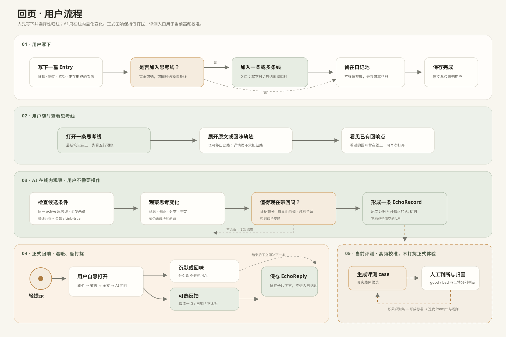
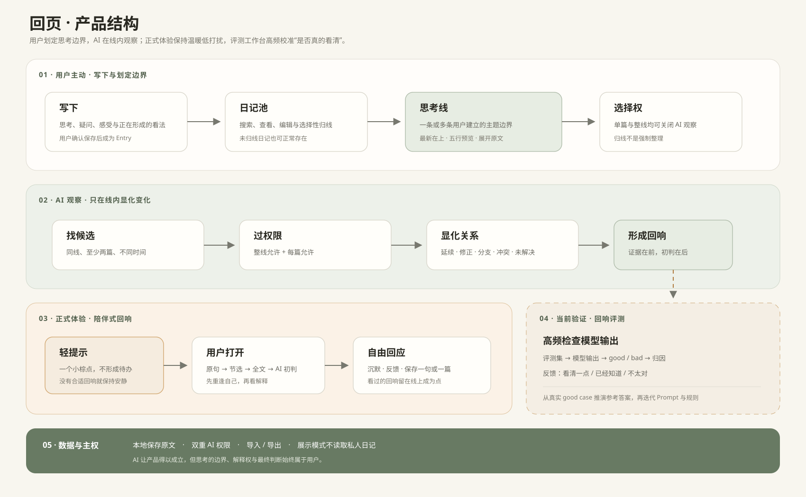
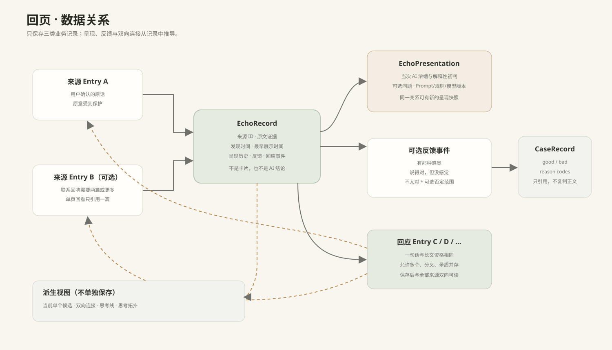

# 回页

> 让思考继续生长。

回页是一款由 AI 才得以成立、但把思考主导权交还给人的个人思考产品。

人会不断记录，也会不断从生活、阅读、交流和新经历中改变。问题不是“没有更多内容”，而是关于同一件事的思考散落在许多日记里，变化隐约发生，却很难及时看清。回页让用户先用特殊标签建立「思考线」，AI 再在线内观察，把用户已经记录、但尚未清楚说出的延续、修正、分支、冲突或未解决问题显化出来。

AI 不替用户建立人生图谱，也不替用户下结论。它只说：“我暂时看见了这里，是否值得你再看一眼？”用户可以回味、回应、继续写，也可以沉默离开。

## 核心体验



### 1. 写下

保存的是用户亲自确认的思考、感受、疑问、判断和自己说出的话，而不是一套理论知识库。是否归入思考线完全可选。

### 2. 归线

用户可以在写下时或日记池编辑时加入特殊标签。一个日记可属于多条线，因此也可能成为几条思考的交汇处。思考线详情页专注于查看轨迹，不再承担归线操作。

### 3. 看清

AI 优先在同一条思考线中寻找至少两篇、发生于不同时间的日记。它展示原文证据，再提出可被用户否定的初步观察。成功不是让用户必须继续写，而是让用户更清楚自己正在怎样思考。

## 产品结构



## 数据关系



三张图均以 [docs/assets](docs/assets/) 中的 SVG 为唯一可编辑源；PNG、BPMN 与 HTML 是便于查看、交流或导入其他工具的同步产物。

权限采用双重边界：整条思考线关闭后不再产生正式回响；单篇日记关闭后，AI 即使在线内也必须跳过这一篇。合并思考线时采用更保守的一侧权限。

## 第一版验证什么

第一版不接入生产模型，也不追求网络图、自动分类或高频提醒。它只验证四件事：

1. 用户是否愿意选择性归线，而不是被迫整理所有记录；
2. 一条线是否能让用户随时看见自己的思考轨迹；
3. AI 在线内提出的观察，是否让用户“看清了一点”；
4. 正式体验能否保持低打扰，而评测入口可以高频积累 good case / bad case。

回响的主质量是「显化价值」：AI 是否把用户已经隐约记录的变化变得更清楚。「重逢感」仍然重要，但成为可能随之发生的体验，而不是产品唯一目的。

## 当前实现

- 本地优先，私人数据保存在 `local-data/` 的不可变代次中；
- 思考线具有稳定 ID，支持多线归属、重命名、归档、恢复、合并和权限控制；
- 回响必须隶属一条用户建立的思考线，历史机制只保留在评测中；
- 已查看的回响以点的形式留在线上，并随反馈呈现不同状态；
- 私人评测与脱敏展示模式分离，展示模式不读取私人日记。

## 文档地图

- [文档索引](docs/01_DOCUMENTATION_INDEX.md)：每份文档的唯一职责与冲突处理；
- [开发入口](docs/02_README.md)：安装、运行、验证和目录说明；
- [产品原则](docs/03_PROJECT_ALIGNMENT.md)：完整产品判断、边界与 MVP 验收；
- [领域语言](docs/04_CONTEXT.md)：项目唯一术语表；
- [数据契约](docs/05_DATA_SCHEMA.md)：对象、字段、约束与兼容策略；
- [技术指南](docs/06_TECHNICAL_GUIDE.md)：当前代码如何运行；
- [路线图](docs/07_ROADMAP.md)：现在、随后与暂不做；
- [ADR-0002](docs/adr/0002-user-bounded-thought-lines.md)：为何从全局 AI 召回转向用户约束的思考线。

## 本地运行

需要 Node.js 22.13+。

```bash
pnpm install
pnpm local
```

默认打开 `http://127.0.0.1:4317`。完整命令和数据安全说明见[开发入口](docs/02_README.md)。

---

回页不承诺替你记住、解释或管理人生。它只希望在变化仍然新鲜时，让你更清楚地看见：原来我正在这样想。
