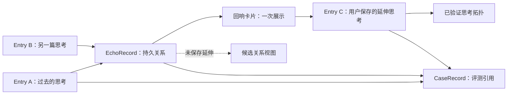

# 回页：产品与数据模型对齐结论

> 状态：已确认的目标方案
> 对齐日期：2026-08-02
> 适用范围：回页本地应用、思考拓扑、回响评测，以及未来作品集展示

## 1. 回页是什么

回页是一个以个人日记为基础的思考回看工具。它不负责管理知识，也不把用户的生活自动解释成结论；它保存用户亲自确认的文字，并在合适的时间把过去的思考带回来，帮助用户看到联系、变化、延伸、感受或仍未解决的问题。

这里记录的是用户对事件的思考、理解和感受。事实、引文、图片等可以作为上下文，但只有用户自己写下并确认保存的思考，才可以成为主动回响的证据。

## 2. 产品边界

- 私人使用的回页应用在本地运行，真实笔记保存在本地文件夹。
- 公开作品集是回页的介绍与演示页面，不承载用户的真实笔记。
- 网站可以展示产品说明、界面效果、演示数据和 GitHub 链接，但不能读取、打包或发布 `local-data`。
- “保存在本地”指数据的权威副本在本机文件中，不再以浏览器 `localStorage` 或云端部署数据作为唯一来源。
- 如果未来使用远程模型分析，必须单独说明“本地存储”不等于“本地推理”，并限制发送范围；不能把整个本地数据目录无差别上传。

## 3. 唯一数据模型

最终只保留三类业务记录：`Entry`、`EchoRecord`、`CaseRecord`。思考线和拓扑图由这些记录推导，不建立第四份重复数据。

### 3.1 Entry（日记）

`Entry` 是用户确认保存的一次思考，是整个系统的原始事实来源。

每篇日记使用一个 Markdown 文件保存：正文是原始日记内容，结构化字段放在 frontmatter 中。附件按 Entry ID 单独保存。

Entry 至少表达：

- 唯一 ID；
- 原始正文；
- 创建和更新时间；
- 标签；
- 是否允许参与未来回响；
- 附件引用。

旧结构中的 `record.json`、重复日期字段、旧状态字段和 `continuesFrom` 不进入最终模型。日记之间的关系统一由 `EchoRecord` 表达。

### 3.2 EchoRecord（回响记录）

`EchoRecord` 是日记之间持久存在的、有证据的思考关系。回响卡片只是它的一种界面展示形式，不等于回响记录本身。

系统可以评估很多候选关系，但只有满足质量门槛、值得在未来呈现的候选关系，才创建 EchoRecord。模型不能因为看起来合理就虚构用户没有写过的原因或变化。

EchoRecord 需要能够追溯：

- 来源 Entry；
- 关系判断及其原文证据；
- 被发现的时间；
- 最早允许展示的时间；
- 展示与用户操作历史；
- 用户是否保存了新的延伸 Entry；
- 生成该判断所依据的规则或模型版本。

只有用户在回响后真正保存了延伸思考，即达到 `continuation_saved`，这条 EchoRecord 才进入“已验证思考拓扑”。尚未保存延伸的记录可以留在候选关系视图中，但不能与已验证关系混为一谈。

### 3.3 CaseRecord（案例评测记录）

`CaseRecord` 用于单独分析 good case 和 bad case，以便迭代回响规则。它是评测索引，不复制日记正文。

它引用现有的 Entry、EchoRecord，以及可选的“案例分析 Entry”，并记录：

- good 或 bad 的评测结论；
- 原因标签；
- 预期行为；
- 实际行为；
- 当时使用的规则版本；
- 创建时间。

案例本身仍然是用户的真实思考，可以进入思考拓扑。用户对案例写下的分析，如果明确保存，也是一篇普通 Entry，同样可以参与未来回响；CaseRecord 只负责把这些材料单独标记出来用于产品分析。

## 4. 思考线与拓扑

`ThoughtLine`（思考线）不是独立存储对象。它是从 Entry 和 EchoRecord 随时推导出的阅读路径。

拓扑图也不是另一套数据源：

- 节点来自 Entry；
- 边来自 EchoRecord；
- 候选拓扑可以显示尚未形成新日记的有效关系；
- 已验证拓扑只显示达到 `continuation_saved` 的关系。



“过去”在回页中的精确定义，是用户在下笔前已经保存到回页、并能由原文核验的 Entry。回页不声称覆盖用户全部过往经验；没有发现联系，也不代表这次思考没有过去的来源。

## 5. 两种回响场景

### 联系回响

两篇或多篇已有 Entry 的联系促成一篇新的 Entry，可概括为 `A + B → C`。这是主要场景，长期展示比例目标约为 80%。

### 回看回响

系统在合适的间隔后带回一篇旧 Entry，用户以当下视角写下新的感受，可概括为 `A + 现在 → B`。长期展示比例目标约为 20%。

80:20 是长期、柔性的展示目标，不能覆盖质量门槛，也不能为了凑比例强行展示。回看回响是“受约束的随机”：只从允许回响、达到时间间隔、近期未重复、未被拒绝且不在冷却期的 Entry 中选择。界面应诚实地说明它是随机回看，不能虚构“为什么偏偏今天出现”。

新日记保存后可以在后台发现关系，但不能立刻把它当成回响展示给用户。发现与展示必须分开：关系先被发现，经过时间错位和资格判断，之后才有机会被呈现。

## 5.1 联系回响卡片

`A + B → C` 的联系回响卡片固定呈现：

1. Entry A 的部分可核验原文、单句 AI 浓缩和时间戳；
2. Entry B 的部分可核验原文、单句 AI 浓缩和时间戳；
3. AI 从 A、B 中发现的一处不同、变化或感受线索；
4. 一个开放问题，邀请用户写下 Entry C。

原文与 AI 浓缩必须有清楚的视觉标记，不能让浓缩结果看起来像用户原话。底部观察应描述证据中可见的差异，避免直接断言用户的动机、性格或因果；问题负责把解释权交还给用户。

原文采用三级阅读：卡片默认显示选中的可核验原句；点击“查看原文”后显示较长的原文节选；原文节选本身仍可点击，继续展开该 Entry 的完整全文。节选边缘使用克制的轻微动效提示“这里可以继续打开”，再次点击逐级收起。动效只提示可交互性，不能持续抢夺阅读注意力，并应尊重系统的“减少动态效果”设置。所有原文都从当前 Entry 读取，EchoRecord 不复制全文。

旧 v1 Echo 不再作为案例，也不迁移到目标 EchoRecord。新的回响关系从原始 Entry 重新发现，并按新的质量门槛重新接受用户评测。

## 6. 对内容的约束

- 延伸 Entry 可以记录变化的原因，但不必须是“原因”。
- 它也可以是确认、深化、疑问、感受、犹豫或尚未解决的矛盾。
- AI 只能引用日记中存在的证据，不能替用户补写动机、因果或人生结论。
- 系统不禁止保存偏知识性的内容，但纯知识不能自动成为主动回响的核心证据；需要有用户自己的理解或感受。

## 7. 本地文件布局

目标布局如下：

```text
local-data/
├─ entries/          # 每篇 Entry 一个当前 Markdown 文件
├─ echoes/           # 每条 EchoRecord 一个当前 JSON 文件
├─ cases/            # 每条 CaseRecord 一个当前 JSON 文件
├─ attachments/      # 按 Entry ID 管理附件
├─ trash/            # 可恢复的软删除内容
├─ journal/          # 原子写入与异常恢复日志
├─ history/          # 有上限的逐记录历史
├─ backups/          # 用户明确创建的完整备份
└─ manifest.json     # 数据版本与完整性信息
```

每类数据只保留一份当前权威文件。写入过程使用事务日志避免断电或进程中止造成半写入；历史记录有明确上限；完整备份由用户主动创建。旧的整库“不可变 generation”不再作为日常存储模型。

历史具体保留数量或天数尚未决定，在实施迁移前单独确定，不得自行无限增长。

## 8. 删除和隐私

删除分两步：

1. 移入回收站：内容从正常界面隐藏，不再参与模型处理或回响，但仍可恢复。
2. 永久删除：删除 Entry、附件、相关 EchoRecord 引用和拓扑边，并清理本地历史中的副本。

用户过去自行导出的备份不受应用控制，应用无法远程抹除，界面和文档必须明确说明这一点。

当某篇 Entry 设置为“不允许回响”时：

- 停止未来关系发现、模型处理和主动展示；
- 已经验证的本地思考线仍可查看；
- 如需移除既有关系，用户应另行删除关系或永久删除 Entry。

## 9. 数据安全与迁移底线

当前 15 篇 Entry 是迁移基线。任何结构改造都必须遵守：

1. 修改前生成用户可见、可独立恢复的完整备份；
2. 记录迁移前数量、唯一 ID、内容哈希和附件数量；
3. 迁移必须写入新位置，不得就地覆盖唯一副本；
4. 校验新结构的数量、ID、正文、关系和附件后，才允许切换读取来源；
5. 旧结构在用户确认新版本正常之前保持只读可恢复；
6. 迁移失败必须自动回滚或保持旧数据可直接启动；
7. `local-data` 始终禁止提交到 Git，也禁止进入公开作品集构建产物。

## 10. 当前实现与目标方案的关系

本文记录的是已经确认的目标，而不是声称代码已经全部完成。当前 Entry 仍使用 v1 字段、`continuesFrom` 和整库 generation；新的 EchoRecord 文件、事件写入与两类三级展开卡片已经以校准形态接入，但 CaseRecord、自动发现、拓扑推导和完整 v2 迁移尚未完成。

文档已经按职责完成整理：

- `02_README.md` 是项目入口和当前状态摘要；
- 本文是已确认产品与数据目标的依据；
- `04_CONTEXT.md` 是统一术语依据；
- `05_DATA_SCHEMA.md` 是目标数据契约和迁移映射；
- `06_TECHNICAL_GUIDE.md` 只陈述当前代码事实与目标差距；
- `07_ROADMAP.md` 记录实施顺序和完成标准。

目标结构尚未完成代码迁移。任何文档都不得把“已确认目标”写成“当前已经实现”。

## 11. 后续实施顺序

1. 固化数据契约与迁移验收清单；
2. 为 15 篇数据制作并验证独立备份；
3. 实现 Entry Markdown、EchoRecord、CaseRecord 和事务写入；
4. 迁移到唯一当前文件结构，并保留旧数据只读回退；
5. 从 Entry + EchoRecord 推导候选拓扑与已验证拓扑；
6. 实现 good case / bad case 的记录与回查；
7. 清理旧云端、旧 schema 和重复文档；
8. 建立公开作品集与私人数据之间的构建隔离；
9. 完整验证后，再由用户决定是否提交、推送或发布作品集。
