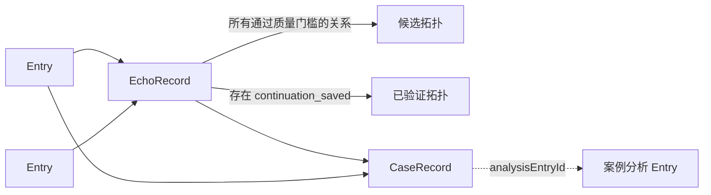

# 回页：本地数据结构

> 状态：已确认的目标数据契约。Entry 迁移尚未开始，EchoRecord 校准链路已局部实现
> 最后更新：2026-08-03

## 1. 数据源与基本规则

`local-data` 是私人数据的唯一主数据源。最终只保存三类业务记录：

1. `Entry`：用户确认保存的日记；
2. `EchoRecord`：Entry 之间有证据的持久关系及使用历史；
3. `CaseRecord`：对已有 Entry 和 EchoRecord 的产品评测引用。

思考线和拓扑是派生视图，不单独保存。浏览器状态、GitHub、Sites/R2 和公开作品集都不是私人日记的主数据源。

## 2. 目标目录

```text
local-data/
├─ entries/                    # <entryId>.md
├─ echoes/                     # <echoRecordId>.json
├─ cases/                      # <caseRecordId>.json
├─ attachments/               # <entryId>/<attachmentId>-<safeName>
├─ trash/                      # 可恢复的软删除记录
├─ journal/                    # 未完成事务与异常恢复信息
├─ history/                    # 有上限的逐记录历史
├─ backups/                    # 用户主动创建的完整备份
└─ manifest.json               # schema 版本、更新时间、数量与完整性摘要
```

每个业务对象只有一份当前权威文件。旧的 `current.json + generations/` 结构只作为迁移来源，不是最终日常存储方式。

## 3. Entry

每篇 Entry 是一个 Markdown 文件：frontmatter 保存结构化字段，frontmatter 之后的 Markdown 正文保存用户确认的原文。

```md
---
schemaVersion: 2
id: 1750000000000
createdAt: 2026-08-02T10:00:00.000Z
updatedAt: 2026-08-02T10:00:00.000Z
title: 可选标题
tags:
  - 工作
allowEcho: true
attachmentIds: []
---

这是用户确认保存的正文。
```

| 字段 | 类型 | 必填 | 含义 |
|---|---|---:|---|
| `schemaVersion` | number | 是 | 目标格式固定为 `2` |
| `id` | number | 是 | Entry 唯一 ID；迁移时保留现有 ID |
| `createdAt` | ISO 时间 | 是 | 首次保存时间 |
| `updatedAt` | ISO 时间 | 是 | 最近一次用户确认保存时间 |
| `title` | string | 否 | 用户标题；允许为空，不由 AI 强制生成 |
| `tags` | `string[]` | 是 | 用户标签；允许空数组 |
| `allowEcho` | boolean | 是 | 是否允许未来关系发现、模型处理和主动展示 |
| `attachmentIds` | `string[]` | 是 | 附件引用；允许空数组 |
| Markdown 正文 | string | 是 | 用户确认的唯一当前正文 |

不进入最终 Entry 的旧字段：`date`、`status`、`source`、`aiLink`、`continuesFrom`、正文内嵌 Base64 附件。`aiLink` 迁移为 `allowEcho`；日记关系迁移为 EchoRecord。

## 4. Attachment

附件文件与 Entry 分开保存，引用信息记录在清单或对应 Entry 的附件索引中。

| 字段 | 类型 | 含义 |
|---|---|---|
| `id` | string | 附件唯一 ID |
| `entryId` | number | 所属 Entry |
| `fileName` | string | 用户看到的原文件名 |
| `mediaType` | string | MIME 类型 |
| `file` | string | `attachments/` 下的相对路径 |
| `sha256` | string | 文件完整性哈希 |
| `createdAt` | ISO 时间 | 附件保存时间 |

## 5. EchoRecord

EchoRecord 只在候选关系通过质量门槛、值得未来呈现时创建。回响卡片是它的一次展示，不是另一个数据对象。

```ts
type EchoMode = "relational" | "reflective_revisit";

type EchoEventType =
  | "presented"
  | "opened"
  | "relation_rejected"
  | "not_now"
  | "continuation_started"
  | "continuation_saved";

type EchoRecord = {
  schemaVersion: 2;
  id: string;
  mode: EchoMode;
  sourceEntryIds: number[];
  triggerEntryId?: number;
  evidence: Array<{ entryId: number; quote: string }>;
  sourceSummaries: Array<{ entryId: number; text: string }>;
  reason: string;
  question?: string;
  discoveredAt: string;
  eligibleAfter: string;
  ruleVersion: string;
  model?: string;
  events: Array<{
    type: EchoEventType;
    createdAt: string;
    resultEntryId?: number;
  }>;
};
```

规则：

- `relational` 表示多篇 Entry 的联系促成新思考，长期展示目标约 80%；
- `reflective_revisit` 表示受约束地随机带回一篇旧 Entry，长期展示目标约 20%；
- `evidence.quote` 必须能在对应 Entry 正文中精确核验；
- `sourceSummaries` 为每个来源 Entry 保存当次卡片使用的一句话 AI 浓缩，必须明确标记为非原文；它用于复现和评测输出，但不复制 Entry 全文；
- 发现时间和最早展示时间必须分开，保存新日记后不能立即展示；
- 只有 `continuation_saved` 事件可以带 `resultEntryId`，并使关系进入已验证拓扑；
- `opened` 或 `continuation_started` 不能算延伸成功；
- 一条关系可以有多次展示或反馈事件，不为每次卡片展示复制 EchoRecord。

## 6. CaseRecord

CaseRecord 是评测引用，不复制 Entry 正文或 EchoRecord 内容。

```ts
type CaseRecord = {
  schemaVersion: 2;
  id: string;
  entryIds: number[];
  echoRecordId?: string;
  verdict: "good" | "bad";
  reasonCodes: string[];
  expectedBehavior: string;
  actualBehavior: string;
  ruleVersion: string;
  analysisEntryId?: number;
  createdAt: string;
};
```

`analysisEntryId` 指向用户明确保存的案例分析 Entry。该 Entry 仍属于思考拓扑；CaseRecord 只将它与案例材料关联起来用于产品迭代。

## 7. 派生视图



拓扑节点始终来自 Entry，边始终来自 EchoRecord。CaseRecord 不创建第三种关系边。

## 8. 写入、历史与删除

- 写入先进入 `journal/`，完成临时写入、哈希校验和原子替换后才确认成功；
- 异常启动时根据事务日志完成或回滚未完成写入；
- `history/` 只保存有上限的逐记录修订，具体保留数量或天数在实施前确定；
- `backups/` 保存用户主动创建的完整备份，不由常规历史策略自动删除；
- 移入 `trash/` 后记录不参与正常读取、模型处理或回响；
- 永久删除必须清理 Entry、附件、相关 EchoRecord、CaseRecord 引用、拓扑边和本地历史副本；
- 用户自行复制到应用外部的备份无法由应用远程删除。

## 9. 当前 v1 到目标 v2 的映射

| 当前结构 | 目标结构 | 处理方式 |
|---|---|---|
| `HuiyeBackup v1.entries[]` | `entries/<id>.md` | 保留 ID、正文、时间和标签；字段规范化 |
| `Entry.aiLink` | `Entry.allowEcho` | 布尔值直接迁移 |
| `Entry.attachments[].data` | `attachments/` | 解码为独立文件并计算哈希 |
| `Entry.date/status/source` | 无 | 验证无业务依赖后移除 |
| `Entry.continuesFrom` | EchoRecord | 转为有证据的关系；不能无证据猜测 |
| `Echo` | 不迁移 | 旧回响已整体废弃；从原始 Entry 按新规则重新发现关系 |
| `echoCheckedIds` | 不迁移 | 旧检查标记随旧 Echo 一起废弃 |
| `current.json + generations/` | 当前文件 + journal/history/backups | 新位置写入并校验后再切换，旧目录保持只读回退 |

## 10. 迁移验收

迁移前后必须对比：

- Entry 总数与唯一 ID 集合；
- 每篇正文的规范化 SHA-256；
- 创建时间、标签、回响许可；
- 附件数量、字节数和 SHA-256；
- 可核验 Echo 关系和事件；
- CaseRecord 引用是否全部可解析；
- `local-data` 是否仍被 Git 和作品集构建排除。

当前有效数据基线是 15 篇 Entry、15 个唯一 ID、0 条 Echo、0 个检查标记、0 个附件。2 条旧 Echo 和 5 个旧检查标记已于 2026-08-02 从当前有效数据清空，并保留一份迁移前安全副本；它们不进入 v2。实施迁移时仍必须重新读取磁盘并生成新的基线报告，不能只依赖本文数字。
