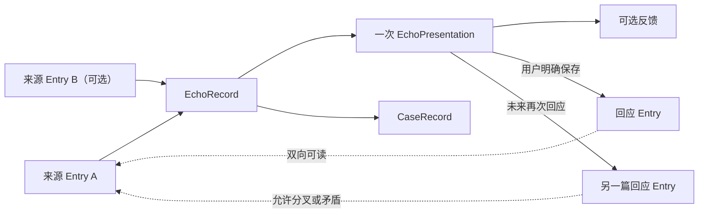

# 回页：本地数据结构

> 状态：已对齐的目标数据契约；Entry v2 迁移、重复呈现与 CaseRecord 尚未实现
> 最后更新：2026-08-05

## 1. 数据源与记录边界

`local-data` 是私人数据的唯一主数据源。最终只保存三类业务记录：

1. `Entry`：用户确认保存的自我表达；
2. `EchoRecord`：有证据的召回候选、呈现、反馈与回应连接；
3. `CaseRecord`：对已有 Entry 和 EchoRecord 的产品评测引用。

思考线、拓扑、当前候选和双向连接都是派生视图，不单独保存。浏览器状态、GitHub、Sites/R2 和公开作品集都不是私人数据源。

## 2. 目标目录

```text
local-data/
├─ entries/                    # <entryId>.md
├─ echoes/                     # <echoRecordId>.json
├─ cases/                      # <caseRecordId>.json
├─ attachments/               # <entryId>/<attachmentId>-<safeName>
├─ trash/                      # 可恢复的软删除记录
├─ journal/                    # 未完成事务与异常恢复信息
├─ history/                    # 有上限的逐记录历史
├─ backups/                    # 用户主动创建的完整备份
└─ manifest.json               # schema 版本、更新时间、数量与完整性摘要
```

## 3. Entry

每篇 Entry 是一个 Markdown 文件。正文保存用户确认的原话，frontmatter 保存结构化字段。

```md
---
schemaVersion: 2
id: 1750000000000
createdAt: 2026-08-02T10:00:00.000Z
updatedAt: 2026-08-02T10:00:00.000Z
title: 可选标题
tags: []
allowEcho: true
attachmentIds: []
---

这是用户确认保存的自我表达。
```

| 字段 | 类型 | 必填 | 含义 |
|---|---|---:|---|
| `schemaVersion` | number | 是 | 目标格式固定为 `2` |
| `id` | number | 是 | Entry 唯一 ID |
| `createdAt` | ISO 时间 | 是 | 首次确认保存时间 |
| `updatedAt` | ISO 时间 | 是 | 最近一次确认修改时间 |
| `title` | string | 否 | 用户标题；允许为空 |
| `tags` | `string[]` | 是 | 用户标签；允许空数组 |
| `allowEcho` | boolean | 是 | 是否允许未来模型处理和主动召回 |
| `attachmentIds` | `string[]` | 是 | 附件引用 |
| Markdown 正文 | string | 是 | 用户确认的唯一当前正文 |

### 3.1 原意与修订

- 不改变含义的纠错可以更新当前 Entry，但必须在 `history/` 留下可恢复修订；
- 实质改写不能静默覆盖过去原意，应保存为明确版本或新的回应 Entry；
- 具体“纠错/实质改写”交互尚待实现前冻结；
- 用户删除权不受原意保护限制。

Entry 不保存 `continuesFrom`。回应连接统一由 EchoRecord 的 `response_saved` 事件表达。

## 4. Attachment

| 字段 | 类型 | 含义 |
|---|---|---|
| `id` | string | 附件唯一 ID |
| `entryId` | number | 所属 Entry |
| `fileName` | string | 用户看到的原文件名 |
| `mediaType` | string | MIME 类型 |
| `file` | string | `attachments/` 下的相对路径 |
| `sha256` | string | 文件完整性哈希 |
| `createdAt` | ISO 时间 | 附件保存时间 |

## 5. EchoRecord

EchoRecord 记录一个通过质量门槛、值得未来呈现的召回候选及其历史。回响卡片不是独立业务对象。

```ts
type EchoMode = "relational" | "reflective_revisit";

type EchoFeedback =
  | "resonated"
  | "accurate_no_resonance"
  | "not_quite";

type RejectionScope =
  | "interpretation"
  | "relationship"
  | "evidence"
  | "other";

type EchoPresentation = {
  id: string;
  createdAt: string;
  sourceSummaries: Array<{ entryId: number; text: string }>;
  hypothesis: string;
  question?: string;
  ruleVersion: string;
  model?: string;
};

type EchoEvent = {
  id: string;
  type:
    | "presented"
    | "opened"
    | "feedback_submitted"
    | "response_started"
    | "response_saved";
  createdAt: string;
  presentationId?: string;
  feedback?: EchoFeedback;
  rejectionScope?: RejectionScope;
  reasonCodes?: string[];
  resultEntryId?: number;
};

type EchoRecord = {
  schemaVersion: 2;
  id: string;
  mode: EchoMode;
  sourceEntryIds: number[];
  triggerEntryId?: number;
  evidence: Array<{ entryId: number; quote: string }>;
  discoveredAt: string;
  eligibleAfter: string;
  cooldownUntil?: string;
  presentations: EchoPresentation[];
  events: EchoEvent[];
};
```

### 5.1 关系与证据

- `relational` 至少引用两篇 Entry；
- `reflective_revisit` 只引用一篇 Entry；
- 两类模式不设固定展示比例；
- `evidence.quote` 必须能在对应 Entry 当前原文或可追溯历史版本中精确核验；
- 纯理论内容不能独立成为主动召回核心证据；
- 发现时间、最早展示时间和实际呈现必须分开。

### 5.2 呈现快照

每次重新评估并准备展示时，创建新的 `EchoPresentation`：

- 保存当次 AI 浓缩、解释性初判、可选问题、规则版本和模型；
- 事件通过 `presentationId` 指向当次呈现；
- “正确而无感”后不能只换措辞立即重发；
- 新呈现必须有明显时间错位、新 Entry 或新的观看角度；
- 当前两个手工 EchoRecord 的顶层 `sourceSummaries/reason/question/ruleVersion/model` 在迁移时映射为首个 presentation，不丢失历史。

### 5.3 反馈事件

- `resonated`：用户明确表示产生重逢感；
- `accurate_no_resonance`：关系或变化成立，但本次时机与呈现无感；
- `not_quite`：本次解释、关系或证据不准确；
- 没有反馈时不写 `feedback_submitted`；
- `not_quite` 默认 `rejectionScope: interpretation`；
- 原因补充可选，不能强制用户填写。

### 5.4 回应事件与双向连接

- 用户进入回应写作时记录 `response_started`；
- 只有明确保存新 Entry 才记录 `response_saved + resultEntryId`；
- 同一 EchoRecord 可以保存多个 `response_saved`；
- 来源到回应：读取该 EchoRecord 全部 `resultEntryId`；
- 回应到来源：由包含该 `resultEntryId` 的 EchoRecord 读取 `sourceEntryIds`；
- 双向连接是派生视图，不在 Entry 中重复存储。

### 5.5 当前旧事件兼容

目标实现完成前，读取端需要兼容：

- `continuation_started` → `response_started`；
- `continuation_saved` → `response_saved`；
- `relation_rejected` → `feedback_submitted(not_quite)`；
- `not_now` 只保留历史，不自动推断为任何新反馈。

## 6. 当前候选派生

用户侧当前候选不是保存对象，而是从 EchoRecord 推导：

1. 已到 `eligibleAfter`；
2. 不在 `cooldownUntil`；
3. 来源 Entry 仍存在并允许回响；
4. 没有被明确永久否定对应范围；
5. 近期未重复；
6. 按质量与新情境选择一个。

用户侧只暴露“是否有一个当前候选”，不暴露候选总数。

## 7. CaseRecord

```ts
type CaseVerdict = "good" | "bad";

type CaseReasonCode =
  | "reencountered"
  | "accurate_no_resonance"
  | "already_active_understanding"
  | "timing_wrong"
  | "interpretation_wrong"
  | "relation_wrong"
  | "quote_out_of_context"
  | "prompt_pressure";

type CaseRecord = {
  schemaVersion: 2;
  id: string;
  entryIds: number[];
  echoRecordId?: string;
  presentationId?: string;
  verdict: CaseVerdict;
  reasonCodes: CaseReasonCode[];
  expectedBehavior: string;
  actualBehavior: string;
  ruleVersion: string;
  analysisEntryId?: number;
  createdAt: string;
};
```

CaseRecord 只引用现有内容，不复制私人正文。用户明确保存的案例分析仍是普通 Entry。

## 8. 派生关系



## 9. 写入、历史与删除

- 写入先进入 `journal/`，校验后原子替换；
- `history/` 只保存有上限的逐记录修订，具体上限仍待冻结；
- `backups/` 保存用户主动创建的完整备份；
- 移入 `trash/` 后不参与读取、模型处理或召回；
- 永久删除必须清理 Entry、附件、EchoRecord/CaseRecord 引用和本地历史副本；
- 应用无法删除用户复制到外部的备份。

## 10. v1 到目标 v2 映射

| 当前结构 | 目标结构 | 处理方式 |
|---|---|---|
| `HuiyeBackup v1.entries[]` | `entries/<id>.md` | 保留 ID、正文、时间、标签与回响许可 |
| `Entry.aiLink` | `Entry.allowEcho` | 布尔值迁移 |
| 内嵌附件 | `attachments/` | 拆出并计算哈希 |
| `Entry.continuesFrom` | EchoRecord 历史兼容 | 只在证据可核验时迁移 |
| 旧 `Echo` / `echoCheckedIds` | 不迁移 | 已废弃 |
| 当前手工 EchoRecord | 新 EchoRecord | 顶层呈现字段映射为首个 presentation；旧事件按兼容表映射 |
| `current.json + generations/` | 当前文件 + journal/history/backups | 新位置写入并校验后切换 |

## 11. 迁移验收

迁移前后必须比较 Entry 数量、ID、正文哈希、时间、标签、权限、附件以及所有可核验关系。2026-08-05 最近一次核对为 23 篇 Entry、23 个唯一 ID；实施迁移时仍必须重新读取磁盘并生成报告。
